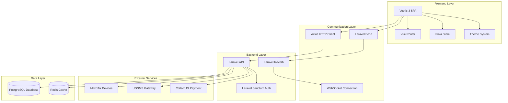

# Design Document: Vue.js Frontend Enhancement

## Overview

This design outlines the architecture for enhancing the existing Laravel billing system with a modern Vue.js 3 frontend, real-time capabilities, theming support, and integrated SMS/payment gateway services. The system will provide a comprehensive internet billing solution with MikroTik integration and voucher management.

The architecture follows a decoupled approach where Laravel serves as a robust API backend while Vue.js 3 provides a reactive, component-based frontend. Real-time features are implemented using Laravel Reverb (WebSocket server) for instant updates across all connected clients.

## Architecture

### High-Level Architecture



### Component Architecture

The Vue.js frontend follows a modular component architecture:

```mermaid
graph TD
    APP[App.vue]
    
    subgraph "Layout Components"
        NAVBAR[NavigationBar.vue]
        SIDEBAR[Sidebar.vue]
        FOOTER[Footer.vue]
    end
    
    subgraph "Feature Components"
        DASHBOARD[Dashboard.vue]
        CUSTOMERS[CustomerManagement.vue]
        VOUCHERS[VoucherManagement.vue]
        PAYMENTS[PaymentManagement.vue]
        MIKROTIK_MONITOR[MikroTikMonitor.vue]
        MIKROTIK_CONFIG[MikroTikConfiguration.vue]
        ROUTER_MANAGER[RouterManagement.vue]
        PAYMENT_ANALYTICS[PaymentAnalytics.vue]
        SMS_MANAGER[SmsManager.vue]
        SETTINGS[Settings.vue]
    end
    
    subgraph "Shared Components"
        DATATABLE[DataTable.vue]
        MODAL[Modal.vue]
        THEME_TOGGLE[ThemeToggle.vue]
        LOADING[LoadingSpinner.vue]
        NOTIFICATION[NotificationCenter.vue]
    end
    
    APP --> NAVBAR
    APP --> SIDEBAR
    APP --> FOOTER
    APP --> DASHBOARD
    APP --> CUSTOMERS
    APP --> VOUCHERS
    APP --> PAYMENTS
    APP --> MIKROTIK_MONITOR
    APP --> MIKROTIK_CONFIG
    APP --> ROUTER_MANAGER
    APP --> PAYMENT_ANALYTICS
    APP --> SMS_MANAGER
    APP --> SETTINGS
    
    DASHBOARD --> DATATABLE
    CUSTOMERS --> DATATABLE
    VOUCHERS --> DATATABLE
    PAYMENTS --> DATATABLE
```



## Components and Interfaces

### Frontend Components

#### 1. Core Application Structure

**App.vue**
- Root component managing global state and theme
- Handles authentication state and route guards
- Manages WebSocket connection lifecycle

**Router Configuration**
- Vue Router 4 with lazy-loaded components
- Route guards for authentication and authorization
- Nested routes for complex layouts

#### 2. Layout Components

**NavigationBar.vue**
- Responsive navigation with user menu
- Real-time notification indicators
- Theme toggle integration
- Search functionality

**Sidebar.vue**
- Collapsible navigation menu
- Role-based menu items
- Active route highlighting
- Mobile-responsive design

#### 3. Feature Components

**Dashboard.vue**
- Real-time statistics widgets
- MikroTik device status overview
- Recent transactions and activities
- Revenue analytics charts

**CustomerManagement.vue**
- Customer CRUD operations
- Advanced search and filtering
- Bulk operations support
- Payment history integration

**VoucherManagement.vue**
- Voucher generation and tracking
- Bulk voucher operations
- Usage analytics and reporting
- SMS delivery integration

**PaymentManagement.vue**
- Payment gateway configuration
- Transaction monitoring
- Revenue reporting
- Refund processing

**MikroTikMonitor.vue**
- Real-time device status monitoring
- Location-based device mapping
- Connection statistics
- Alert management

**MikroTikConfiguration.vue**
- Device configuration interface
- User management for routers
- Interface configuration
- Backup and restore functionality

**RouterManagement.vue**
- Router addition with modal interface
- Device credential management
- Connection testing and validation
- Router editing and deletion

**PaymentAnalytics.vue**
- Comprehensive payment reporting
- Revenue trend analysis
- Gateway performance metrics
- Payment testing interface
- Transaction editing capabilities

#### 4. Shared Components

**DataTable.vue**
- Sortable columns with visual indicators
- Global and column-specific search
- Pagination with configurable page sizes
- Export functionality (CSV, PDF)
- Real-time data updates
- Responsive design for mobile devices

**Modal.vue**
- Reusable modal component for forms
- Router addition and configuration
- Payment editing interface
- Confirmation dialogs

**ThemeToggle.vue**
- System theme detection
- Smooth theme transitions
- Preference persistence
- Icon animations

### Backend API Structure

#### 1. Authentication & Authorization

```php
// API Routes with Sanctum authentication
Route::middleware('auth:sanctum')->group(function () {
    Route::apiResource('customers', CustomerController::class);
    Route::apiResource('vouchers', VoucherController::class);
    Route::apiResource('payments', PaymentController::class);
    Route::get('mikrotik/status', [MikroTikController::class, 'status']);
    Route::post('sms/send', [SmsController::class, 'send']);
});
```

#### 2. Real-time Broadcasting

```php
// Event Broadcasting for real-time updates
class MikroTikStatusUpdated implements ShouldBroadcast
{
    public function broadcastOn()
    {
        return new Channel('mikrotik-status');
    }
}

class PaymentProcessed implements ShouldBroadcast
{
    public function broadcastOn()
    {
        return new PrivateChannel('payments.' . $this->tenantId);
    }
}
```

#### 3. API Resource Controllers

**CustomerController**
- CRUD operations with validation
- Search and filtering capabilities
- Relationship loading optimization
- Bulk operations support

**VoucherController**
- Voucher generation with configurable parameters
- Usage tracking and analytics
- Expiration management
- SMS integration for delivery

**PaymentController**
- Payment processing with multiple gateways
- Transaction status tracking
- Webhook handling for payment confirmations
- Refund processing
- Payment analytics and reporting
- Payment testing functionality
- Transaction editing with audit trails

**MikroTikController**
- Device management and configuration
- Real-time status monitoring
- API integration with RouterOS
- Device credential management
- Configuration backup and restore

## Data Models

### Database Schema

#### 1. Core Entities

```sql
-- Enhanced Customer Model
CREATE TABLE customers (
    id UUID PRIMARY KEY,
    name VARCHAR(255) NOT NULL,
    email VARCHAR(255) UNIQUE,
    phone VARCHAR(20) NOT NULL,
    location JSONB,
    service_plan_id UUID,
    status ENUM('active', 'suspended', 'inactive'),
    created_at TIMESTAMP,
    updated_at TIMESTAMP,
    INDEX idx_customers_phone (phone),
    INDEX idx_customers_status (status)
);

-- Enhanced Voucher Model
CREATE TABLE vouchers (
    id UUID PRIMARY KEY,
    code VARCHAR(50) UNIQUE NOT NULL,
    customer_id UUID,
    amount DECIMAL(10,2) NOT NULL,
    duration_hours INTEGER NOT NULL,
    status ENUM('unused', 'active', 'expired', 'suspended'),
    activated_at TIMESTAMP NULL,
    expires_at TIMESTAMP NULL,
    mikrotik_device_id UUID,
    created_at TIMESTAMP,
    updated_at TIMESTAMP,
    INDEX idx_vouchers_code (code),
    INDEX idx_vouchers_status (status),
    INDEX idx_vouchers_customer (customer_id)
);

-- Enhanced Payment Model
CREATE TABLE payments (
    id UUID PRIMARY KEY,
    customer_id UUID,
    voucher_id UUID NULL,
    gateway_id UUID NOT NULL,
    amount DECIMAL(10,2) NOT NULL,
    currency VARCHAR(3) DEFAULT 'UGX',
    status ENUM('pending', 'processing', 'completed', 'failed', 'refunded'),
    gateway_transaction_id VARCHAR(255),
    gateway_reference VARCHAR(255),
    callback_data JSONB,
    processed_at TIMESTAMP NULL,
    created_at TIMESTAMP,
    updated_at TIMESTAMP,
    INDEX idx_payments_status (status),
    INDEX idx_payments_customer (customer_id),
    INDEX idx_payments_gateway (gateway_id)
);

-- Enhanced MikroTik Device Management
CREATE TABLE mikrotik_devices (
    id UUID PRIMARY KEY,
    name VARCHAR(255) NOT NULL,
    ip_address INET NOT NULL,
    location JSONB NOT NULL,
    api_port INTEGER DEFAULT 8728,
    username VARCHAR(100) NOT NULL,
    password_encrypted TEXT NOT NULL,
    status ENUM('online', 'offline', 'error') DEFAULT 'offline',
    last_seen TIMESTAMP NULL,
    uptime_seconds BIGINT DEFAULT 0,
    configuration JSONB NULL,
    backup_data JSONB NULL,
    created_at TIMESTAMP,
    updated_at TIMESTAMP,
    INDEX idx_mikrotik_status (status),
    INDEX idx_mikrotik_location ((location->>'region'))
);

-- MikroTik Configuration History
CREATE TABLE mikrotik_config_history (
    id UUID PRIMARY KEY,
    device_id UUID NOT NULL,
    configuration_data JSONB NOT NULL,
    change_type ENUM('backup', 'restore', 'update') NOT NULL,
    changed_by UUID NOT NULL,
    created_at TIMESTAMP,
    FOREIGN KEY (device_id) REFERENCES mikrotik_devices(id),
    FOREIGN KEY (changed_by) REFERENCES users(id)
);

-- MikroTik Users (for voucher integration)
CREATE TABLE mikrotik_users (
    id UUID PRIMARY KEY,
    device_id UUID NOT NULL,
    username VARCHAR(100) NOT NULL,
    password VARCHAR(100) NOT NULL,
    profile VARCHAR(100) NOT NULL,
    voucher_id UUID NULL,
    is_active BOOLEAN DEFAULT true,
    created_at TIMESTAMP,
    updated_at TIMESTAMP,
    FOREIGN KEY (device_id) REFERENCES mikrotik_devices(id),
    FOREIGN KEY (voucher_id) REFERENCES vouchers(id),
    UNIQUE KEY unique_device_username (device_id, username)
);

-- Payment Gateway Configuration
CREATE TABLE payment_gateways (
    id UUID PRIMARY KEY,
    name VARCHAR(100) NOT NULL,
    provider ENUM('collectug', 'other') NOT NULL,
    api_key_encrypted TEXT NOT NULL,
    api_secret_encrypted TEXT NULL,
    webhook_url VARCHAR(500),
    is_active BOOLEAN DEFAULT true,
    configuration JSONB,
    created_at TIMESTAMP,
    updated_at TIMESTAMP
);

-- SMS Configuration and Logs
CREATE TABLE sms_configurations (
    id UUID PRIMARY KEY,
    provider ENUM('ugsms') NOT NULL,
    api_key_encrypted TEXT NOT NULL,
    sender_id VARCHAR(20),
    is_active BOOLEAN DEFAULT true,
    created_at TIMESTAMP,
    updated_at TIMESTAMP
);

CREATE TABLE sms_logs (
    id UUID PRIMARY KEY,
    customer_id UUID NULL,
    phone_number VARCHAR(20) NOT NULL,
    message TEXT NOT NULL,
    status ENUM('pending', 'sent', 'delivered', 'failed'),
    provider_response JSONB,
    cost DECIMAL(8,4) NULL,
    sent_at TIMESTAMP NULL,
    created_at TIMESTAMP,
    INDEX idx_sms_status (status),
    INDEX idx_sms_phone (phone_number)
);
```

#### 2. Data Transfer Objects (DTOs)

```php
// Payment Request DTO
class PaymentRequestDTO
{
    public function __construct(
        public readonly float $amount,
        public readonly string $currency,
        public readonly string $customerId,
        public readonly ?string $voucherId,
        public readonly string $gatewayId,
        public readonly array $gatewayData
    ) {}
}

// MikroTik Status DTO
class MikroTikStatusDTO
{
    public function __construct(
        public readonly string $deviceId,
        public readonly string $status,
        public readonly ?int $uptime,
        public readonly ?Carbon $lastSeen,
        public readonly array $statistics
    ) {}
}

// MikroTik Configuration DTO
class MikroTikConfigDTO
{
    public function __construct(
        public readonly string $deviceId,
        public readonly array $configuration,
        public readonly string $changeType,
        public readonly string $changedBy
    ) {}
}

// Router Management DTO
class RouterManagementDTO
{
    public function __construct(
        public readonly string $name,
        public readonly string $ipAddress,
        public readonly int $apiPort,
        public readonly string $username,
        public readonly string $password,
        public readonly array $location,
        public readonly ?array $configuration = null
    ) {}
}

// Payment Analytics DTO
class PaymentAnalyticsDTO
{
    public function __construct(
        public readonly array $revenueData,
        public readonly array $gatewayPerformance,
        public readonly array $successRates,
        public readonly array $transactionTrends
    ) {}
}

// SMS Message DTO
class SmsMessageDTO
{
    public function __construct(
        public readonly string $phoneNumber,
        public readonly string $message,
        public readonly ?string $customerId = null,
        public readonly ?string $senderId = null
    ) {}
}
```

#### 3. Laravel Observer Pattern

```php
// MikroTik Device Observer
class MikroTikDeviceObserver
{
    public function updated(MikroTikDevice $device): void
    {
        // Broadcast status changes in real-time
        if ($device->wasChanged('status')) {
            broadcast(new MikroTikStatusUpdated($device));
            
            // Log status change
            SystemLog::create([
                'type' => 'mikrotik_status_change',
                'data' => [
                    'device_id' => $device->id,
                    'old_status' => $device->getOriginal('status'),
                    'new_status' => $device->status,
                    'timestamp' => now()
                ]
            ]);
        }
        
        // Handle configuration changes
        if ($device->wasChanged('configuration')) {
            MikroTikConfigHistory::create([
                'device_id' => $device->id,
                'configuration_data' => $device->configuration,
                'change_type' => 'update',
                'changed_by' => auth()->id()
            ]);
        }
    }
    
    public function created(MikroTikDevice $device): void
    {
        // Initialize device monitoring
        dispatch(new InitializeMikroTikMonitoring($device));
        
        // Broadcast new device addition
        broadcast(new MikroTikDeviceAdded($device));
    }
}

// Payment Observer
class PaymentObserver
{
    public function updated(Payment $payment): void
    {
        if ($payment->wasChanged('status')) {
            // Handle voucher activation on successful payment
            if ($payment->status === 'completed' && $payment->voucher_id) {
                dispatch(new ActivateVoucher($payment->voucher_id));
            }
            
            // Broadcast payment status change
            broadcast(new PaymentStatusUpdated($payment));
        }
    }
}

// Voucher Observer
class VoucherObserver
{
    public function updated(Voucher $voucher): void
    {
        if ($voucher->wasChanged('status')) {
            // Handle MikroTik user management
            if ($voucher->status === 'active') {
                dispatch(new CreateMikroTikUser($voucher));
            } elseif ($voucher->status === 'expired') {
                dispatch(new DisableMikroTikUser($voucher));
            }
            
            // Broadcast voucher status change
            broadcast(new VoucherStatusUpdated($voucher));
        }
    }
}
```

### Frontend State Management

#### Pinia Store Structure

```typescript
// Main Application Store
export const useAppStore = defineStore('app', {
  state: () => ({
    user: null as User | null,
    theme: 'system' as 'light' | 'dark' | 'system',
    notifications: [] as Notification[],
    isLoading: false
  }),
  
  actions: {
    async login(credentials: LoginCredentials) {
      // Authentication logic
    },
    
    toggleTheme() {
      // Theme switching logic
    },
    
    addNotification(notification: Notification) {
      // Notification management
    }
  }
})

// Real-time Data Store
export const useRealtimeStore = defineStore('realtime', {
  state: () => ({
    mikrotikDevices: [] as MikroTikDevice[],
    recentPayments: [] as Payment[],
    activeVouchers: [] as Voucher[],
    connectionStatus: 'disconnected' as 'connected' | 'disconnected' | 'reconnecting'
  }),
  
  actions: {
    initializeWebSocket() {
      // WebSocket connection setup
    },
    
    updateMikroTikStatus(deviceId: string, status: DeviceStatus) {
      // Real-time device status updates
    }
  }
})
```

## Correctness Properties

*A property is a characteristic or behavior that should hold true across all valid executions of a system-essentially, a formal statement about what the system should do. Properties serve as the bridge between human-readable specifications and machine-verifiable correctness guarantees.*

Based on the prework analysis, the following properties validate the system's correctness:

### Property 1: API Communication Consistency
*For any* valid API request from the Vue frontend, the Laravel backend should return a properly formatted response with correct status codes and data structure.
**Validates: Requirements 1.3**

### Property 2: Navigation Route Mapping
*For any* valid route in the application, navigating to that route should render the correct Vue component and update the browser URL accordingly.
**Validates: Requirements 1.5**

### Property 3: Real-time Data Synchronization
*For any* data change event (MikroTik status, payment, voucher), all connected clients should receive the update within the specified time window and reflect the change in their UI.
**Validates: Requirements 2.1, 2.3, 2.5, 8.1, 8.2**

### Property 4: Theme System Consistency
*For any* theme change (light, dark, system), all UI components should consistently apply the new theme styles and the preference should persist across sessions.
**Validates: Requirements 3.2, 3.3, 3.4**

### Property 5: DataTable Search Functionality
*For any* search query across any data table, the results should include all records that contain the search term in any searchable column.
**Validates: Requirements 4.1, 9.1**

### Property 6: DataTable Sorting Behavior
*For any* sortable column in any data table, clicking the column header should sort the data in ascending order first, then descending on subsequent clicks.
**Validates: Requirements 4.2**

### Property 7: DataTable State Persistence
*For any* search or sort operation on a data table, the state should be maintained when navigating away and returning to the same table.
**Validates: Requirements 4.5**

### Property 8: Export Data Consistency
*For any* filtered dataset in a data table, the exported data should contain exactly the same records as displayed in the filtered view.
**Validates: Requirements 4.6**

### Property 9: Device Status Indicator Mapping
*For any* MikroTik device, the status indicator color should correctly reflect the device state (green for online, red for offline).
**Validates: Requirements 5.1, 5.2**

### Property 10: Device Status Update Timing
*For any* MikroTik device status change, the system should detect and update the status within the 30-second polling interval.
**Validates: Requirements 5.4**

### Property 11: Status Change Logging
*For any* MikroTik device status change, a log entry should be created with the correct timestamp and status information.
**Validates: Requirements 5.5**

### Property 12: SMS API Key Usage
*For any* SMS sending operation, the system should use the currently configured API key from the dashboard settings.
**Validates: Requirements 6.2**

### Property 13: Phone Number Validation
*For any* phone number input for SMS sending, invalid formats should be rejected before attempting to send the message.
**Validates: Requirements 6.3**

### Property 14: SMS Error Handling and Retry
*For any* failed SMS sending attempt, the system should log the error details and implement the configured retry mechanism.
**Validates: Requirements 6.4**

### Property 15: SMS Delivery Tracking
*For any* SMS sent through the system, the delivery status and associated costs should be tracked and stored.
**Validates: Requirements 6.5**

### Property 16: API Key Security
*For any* API key stored in the system, it should be encrypted in the database and masked when displayed in the user interface.
**Validates: Requirements 7.2, 7.5, 12.2**

### Property 17: API Key Format Validation
*For any* API key input, the system should validate the format before saving and reject invalid formats with appropriate error messages.
**Validates: Requirements 7.3, 11.3**

### Property 18: API Connectivity Testing
*For any* API key configuration, the system should test connectivity to the external service and report the connection status.
**Validates: Requirements 7.4, 12.3**

### Property 19: Bulk Operation Progress Tracking
*For any* bulk voucher operation, the system should display accurate progress indicators showing completion percentage and remaining items.
**Validates: Requirements 8.3**

### Property 20: Voucher Usage Tracking
*For any* voucher activation or expiration event, the system should automatically update the voucher status and usage statistics.
**Validates: Requirements 8.4**

### Property 21: Voucher SMS Notification
*For any* voucher delivery event, an SMS notification should be sent to the associated customer with the voucher details.
**Validates: Requirements 8.5**

### Property 22: Customer Data Display Completeness
*For any* customer record viewed in the system, all required information (payment history, current status, location, service plan) should be displayed.
**Validates: Requirements 9.2, 9.4**

### Property 23: Customer Communication History
*For any* customer record, the communication history should include all SMS logs associated with that customer.
**Validates: Requirements 9.5**

### Property 24: Voucher Purchase Data Completeness
*For any* voucher purchase record, the system should display the purchase date, time, duration, expiration, amount paid, and activation status.
**Validates: Requirements 10.1, 10.2, 10.3, 10.6**

### Property 25: Voucher Analytics Accuracy
*For any* voucher analytics report, the data should accurately reflect the actual voucher usage patterns and revenue calculations.
**Validates: Requirements 10.4**

### Property 26: Voucher-Customer-Payment Linking
*For any* voucher purchase, the system should maintain proper relationships between the voucher, customer account, and payment method used.
**Validates: Requirements 10.5**

### Property 27: Payment Gateway Processing
*For any* payment request, the system should route it through the correct configured gateway and track the transaction status appropriately.
**Validates: Requirements 11.4**

### Property 28: Payment Status and Voucher Availability
*For any* payment status change, the system should update voucher availability accordingly (activate on success, maintain pending on failure).
**Validates: Requirements 11.5**

### Property 29: Payment Reconciliation Data
*For any* payment transaction, the system should provide complete reconciliation data and maintain accurate transaction history.
**Validates: Requirements 11.6**

### Property 30: Multi-Gateway Support
*For any* system configuration with multiple active payment gateways, all gateways should be available for processing payments simultaneously.
**Validates: Requirements 11.7**

### Property 31: Payment Callback Processing
*For any* payment callback or webhook received, the system should process it correctly and update the corresponding transaction status.
**Validates: Requirements 11.8**

### Property 32: Payment Method Management
*For any* payment gateway configuration, individual payment methods should be able to be enabled or disabled independently.
**Validates: Requirements 12.4**

### Property 33: Gateway Analytics Tracking
*For any* payment gateway, the system should accurately track transaction fees, success rates, and provide gateway-specific analytics.
**Validates: Requirements 12.5, 12.6**

### Property 34: Data Caching Behavior
*For any* frequently accessed data, the system should cache it locally and retrieve from cache when available to improve performance.
**Validates: Requirements 13.4**

### Property 35: Loading Indicator Display
*For any* asynchronous operation in the system, appropriate loading indicators should be displayed during the operation and hidden upon completion.
**Validates: Requirements 13.5**

### Property 36: Router Connection Validation
*For any* router configuration being saved, the system should validate connection details and reject invalid configurations with appropriate error messages.
**Validates: Requirements 14.2**

### Property 37: Router Credential Encryption
*For any* router credentials stored in the system, they should be encrypted in the database and never stored in plain text.
**Validates: Requirements 14.3**

### Property 38: Router Connectivity Testing
*For any* router being added to the system, connectivity testing should be performed and the results should be reported to the user.
**Validates: Requirements 14.4**

### Property 39: Router CRUD Operations
*For any* router in the system, editing and deletion operations should work correctly and update the database appropriately.
**Validates: Requirements 14.5**

### Property 40: Router Management Interface Display
*For any* router in the management interface, all required status and configuration information should be displayed correctly.
**Validates: Requirements 14.6**

### Property 41: Real-time Router Statistics Display
*For any* router being monitored, real-time statistics should be retrieved and displayed in the monitoring interface.
**Validates: Requirements 15.1**

### Property 42: Router Monitoring Data Completeness
*For any* router monitoring display, active connections, bandwidth usage, and system resources should all be included in the data.
**Validates: Requirements 15.2**

### Property 43: Router Configuration Modifications
*For any* router configuration change, the modifications should be applied correctly and reflected in the device settings.
**Validates: Requirements 15.3**

### Property 44: Router Interface and User Management
*For any* router configuration interface, interface configuration and user management capabilities should be available and functional.
**Validates: Requirements 15.4**

### Property 45: Router Log Display
*For any* router in the system, logs and system information should be retrievable and displayed correctly.
**Validates: Requirements 15.5**

### Property 46: Router Configuration Backup and Restore
*For any* router configuration, backing up and then restoring should preserve the original configuration state.
**Validates: Requirements 15.6**

### Property 47: MikroTik Database Storage
*For any* MikroTik device configuration, it should be stored in the database and retrievable with all configuration details intact.
**Validates: Requirements 16.1**

### Property 48: Laravel Observer Triggering
*For any* MikroTik device data change, Laravel observers should be triggered and execute the appropriate update logic.
**Validates: Requirements 16.2**

### Property 49: Configuration Change Audit Logging
*For any* MikroTik device configuration change, an audit log entry should be created with the change details and timestamp.
**Validates: Requirements 16.3**

### Property 50: Device Status Synchronization
*For any* MikroTik device status change, the change should be automatically synchronized to the database.
**Validates: Requirements 16.4**

### Property 51: Real-time Device Change Broadcasting
*For any* MikroTik device change, the change should be broadcast to all connected clients in real-time.
**Validates: Requirements 16.5**

### Property 52: Device Connection Failure Handling
*For any* MikroTik device connection failure, the system should handle it gracefully and log appropriate error information.
**Validates: Requirements 16.6**

### Property 53: Payment Analytics Generation
*For any* payment data in the system, detailed analytics with charts and reports should be generated correctly.
**Validates: Requirements 17.1**

### Property 54: Payment Analytics Data Completeness
*For any* payment analytics view, success rates, revenue trends, and gateway performance metrics should all be included.
**Validates: Requirements 17.2**

### Property 55: Payment Gateway Connectivity Testing
*For any* payment gateway configuration, connectivity testing should verify the gateway connection and report results.
**Validates: Requirements 17.3**

### Property 56: Payment Gateway Test Transactions
*For any* payment gateway being tested, test transactions should be performed and results should be reported accurately.
**Validates: Requirements 17.4**

### Property 57: Payment Record Editing
*For any* payment record in the system, editing should be allowed for corrections and adjustments with proper validation.
**Validates: Requirements 17.5**

### Property 58: Payment Modification Audit Trails
*For any* payment record modification, an audit trail should be created documenting the change and who made it.
**Validates: Requirements 17.6**

### Property 59: Payment Reconciliation Tools
*For any* payment data, reconciliation tools should work correctly and provide accurate dispute management capabilities.
**Validates: Requirements 17.7**

### Property 60: MikroTik API Integration
*For any* MikroTik device, API communication should work correctly for device management and monitoring operations.
**Validates: Requirements 18.1**

### Property 61: MikroTik API Authentication
*For any* MikroTik device connection, secure API authentication should be used and credentials should be protected.
**Validates: Requirements 18.2**

### Property 62: Real-time API Monitoring
*For any* MikroTik device, real-time monitoring through API calls should provide accurate and current device information.
**Validates: Requirements 18.3**

### Property 63: API Configuration Changes
*For any* MikroTik device configuration change through API, the changes should be applied correctly and reflected on the device.
**Validates: Requirements 18.4**

### Property 64: API Error Handling
*For any* MikroTik API connection error or timeout, the system should handle it gracefully and provide appropriate error messages.
**Validates: Requirements 18.5**

### Property 65: API Response Caching
*For any* MikroTik API response, appropriate caching should be implemented for performance optimization without compromising data accuracy.
**Validates: Requirements 18.6**

### Property 66: API Rate Limiting and Connection Pooling
*For any* MikroTik API usage, rate limiting and connection pooling should be implemented to manage performance and resource usage.
**Validates: Requirements 18.7**

### Property 67: Advanced Voucher Generation
*For any* set of voucher generation parameters, the system should generate vouchers correctly with the specified customizable parameters.
**Validates: Requirements 19.1**

### Property 68: Voucher Batch Operations with Progress Tracking
*For any* voucher batch operation, progress tracking should accurately reflect the completion status and remaining items.
**Validates: Requirements 19.2**

### Property 69: Voucher-MikroTik Integration
*For any* voucher activation, the system should create corresponding MikroTik users and manage the integration correctly.
**Validates: Requirements 19.3**

### Property 70: Voucher Usage Analytics
*For any* voucher usage data, analytics should provide accurate insights into customer behavior and usage patterns.
**Validates: Requirements 19.4**

### Property 71: Voucher Transfer Functionality
*For any* voucher transfer between customers, the transfer should be processed correctly and update all relevant records.
**Validates: Requirements 19.5**

### Property 72: Voucher Expiration Management
*For any* voucher with expiration policies, the system should apply expiration rules correctly and perform automatic cleanup.
**Validates: Requirements 19.6**

### Property 73: Voucher Refund and Cancellation
*For any* voucher refund or cancellation request, the system should process it correctly and update all related records appropriately.
**Validates: Requirements 19.7**

### Property 74: Logout Data Clearing
*For any* logout action, the system should clear all authentication data, cached information, and session storage completely.
**Validates: Requirements 20.1, 20.5**

### Property 75: Logout Navigation
*For any* successful logout, the system should redirect the user to the landing page and prevent access to authenticated routes.
**Validates: Requirements 20.2, 20.4**

### Property 76: Logout Confirmation
*For any* logout action, the system should display an appropriate confirmation message to the user.
**Validates: Requirements 20.3**

## Error Handling

### Frontend Error Handling

#### 1. API Error Management

```typescript
// Axios interceptor for global error handling
axios.interceptors.response.use(
  (response) => response,
  (error) => {
    const { status, data } = error.response || {};
    
    switch (status) {
      case 401:
        // Handle authentication errors
        authStore.logout();
        router.push('/login');
        break;
      case 403:
        // Handle authorization errors
        notificationStore.addError('Access denied');
        break;
      case 422:
        // Handle validation errors
        return Promise.reject(new ValidationError(data.errors));
      case 500:
        // Handle server errors
        notificationStore.addError('Server error occurred');
        break;
      default:
        // Handle network errors
        notificationStore.addError('Network error occurred');
    }
    
    return Promise.reject(error);
  }
);
```

#### 2. Real-time Connection Error Handling

```typescript
// WebSocket connection error handling
export const useWebSocketConnection = () => {
  const connectionStatus = ref('disconnected');
  const reconnectAttempts = ref(0);
  const maxReconnectAttempts = 5;
  
  const handleConnectionError = () => {
    connectionStatus.value = 'reconnecting';
    
    if (reconnectAttempts.value < maxReconnectAttempts) {
      setTimeout(() => {
        reconnectAttempts.value++;
        initializeConnection();
      }, Math.pow(2, reconnectAttempts.value) * 1000); // Exponential backoff
    } else {
      connectionStatus.value = 'failed';
      notificationStore.addError('Real-time connection failed');
    }
  };
};
```

#### 3. Component Error Boundaries

```vue
<!-- ErrorBoundary.vue -->
<template>
  <div v-if="hasError" class="error-boundary">
    <h3>Something went wrong</h3>
    <p>{{ errorMessage }}</p>
    <button @click="retry">Try Again</button>
  </div>
  <slot v-else />
</template>

<script setup lang="ts">
import { ref, onErrorCaptured } from 'vue';

const hasError = ref(false);
const errorMessage = ref('');

onErrorCaptured((error) => {
  hasError.value = true;
  errorMessage.value = error.message;
  console.error('Component error:', error);
  return false;
});

const retry = () => {
  hasError.value = false;
  errorMessage.value = '';
};
</script>
```

### Backend Error Handling

#### 1. API Exception Handling

```php
// Global exception handler
class Handler extends ExceptionHandler
{
    public function render($request, Throwable $exception)
    {
        if ($request->expectsJson()) {
            return match (true) {
                $exception instanceof ValidationException => response()->json([
                    'message' => 'Validation failed',
                    'errors' => $exception->errors()
                ], 422),
                
                $exception instanceof AuthenticationException => response()->json([
                    'message' => 'Unauthenticated'
                ], 401),
                
                $exception instanceof AuthorizationException => response()->json([
                    'message' => 'Unauthorized'
                ], 403),
                
                $exception instanceof PaymentGatewayException => response()->json([
                    'message' => 'Payment processing failed',
                    'error_code' => $exception->getCode()
                ], 400),
                
                $exception instanceof MikroTikConnectionException => response()->json([
                    'message' => 'MikroTik device connection failed',
                    'device_id' => $exception->getDeviceId()
                ], 503),
                
                default => response()->json([
                    'message' => 'Server error occurred'
                ], 500)
            };
        }
        
        return parent::render($request, $exception);
    }
}
```

#### 2. Payment Gateway Error Handling

```php
class PaymentService
{
    public function processPayment(PaymentRequestDTO $request): PaymentResponseDTO
    {
        try {
            $gateway = $this->getGateway($request->gatewayId);
            $response = $gateway->processPayment($request);
            
            // Log successful payment
            Log::info('Payment processed successfully', [
                'payment_id' => $response->paymentId,
                'gateway' => $gateway->getName()
            ]);
            
            return $response;
            
        } catch (GatewayConnectionException $e) {
            // Handle gateway connection errors
            Log::error('Gateway connection failed', [
                'gateway_id' => $request->gatewayId,
                'error' => $e->getMessage()
            ]);
            
            throw new PaymentGatewayException(
                'Payment gateway temporarily unavailable',
                'GATEWAY_UNAVAILABLE'
            );
            
        } catch (InvalidCredentialsException $e) {
            // Handle authentication errors
            Log::error('Gateway authentication failed', [
                'gateway_id' => $request->gatewayId
            ]);
            
            throw new PaymentGatewayException(
                'Payment gateway configuration error',
                'INVALID_CREDENTIALS'
            );
            
        } catch (InsufficientFundsException $e) {
            // Handle customer-side errors
            return new PaymentResponseDTO(
                status: 'failed',
                errorCode: 'INSUFFICIENT_FUNDS',
                message: 'Insufficient funds for this transaction'
            );
        }
    }
}
```

#### 3. MikroTik Device Error Handling

```php
class MikroTikService
{
    public function getDeviceStatus(string $deviceId): MikroTikStatusDTO
    {
        $device = MikroTikDevice::findOrFail($deviceId);
        
        try {
            $api = new RouterOSAPI();
            $api->connect($device->ip_address, $device->username, $device->password);
            
            $status = $api->comm('/system/resource/print');
            $uptime = $status[0]['uptime'] ?? 0;
            
            $api->disconnect();
            
            // Update device status
            $device->update([
                'status' => 'online',
                'last_seen' => now(),
                'uptime_seconds' => $this->parseUptime($uptime)
            ]);
            
            return new MikroTikStatusDTO(
                deviceId: $deviceId,
                status: 'online',
                uptime: $this->parseUptime($uptime),
                lastSeen: now(),
                statistics: $status[0]
            );
            
        } catch (Exception $e) {
            // Handle connection errors
            Log::warning('MikroTik device connection failed', [
                'device_id' => $deviceId,
                'ip_address' => $device->ip_address,
                'error' => $e->getMessage()
            ]);
            
            $device->update([
                'status' => 'offline',
                'last_seen' => $device->last_seen // Keep previous last_seen
            ]);
            
            return new MikroTikStatusDTO(
                deviceId: $deviceId,
                status: 'offline',
                uptime: null,
                lastSeen: $device->last_seen,
                statistics: []
            );
        }
    }
    
    public function addRouter(RouterManagementDTO $routerData): MikroTikDevice
    {
        try {
            // Test connectivity before saving
            $this->testRouterConnectivity($routerData);
            
            $device = MikroTikDevice::create([
                'name' => $routerData->name,
                'ip_address' => $routerData->ipAddress,
                'api_port' => $routerData->apiPort,
                'username' => $routerData->username,
                'password_encrypted' => encrypt($routerData->password),
                'location' => $routerData->location,
                'configuration' => $routerData->configuration
            ]);
            
            // Initialize monitoring
            dispatch(new InitializeMikroTikMonitoring($device));
            
            return $device;
            
        } catch (RouterConnectionException $e) {
            throw new RouterManagementException(
                'Failed to connect to router: ' . $e->getMessage(),
                'CONNECTION_FAILED'
            );
        } catch (Exception $e) {
            Log::error('Router addition failed', [
                'ip_address' => $routerData->ipAddress,
                'error' => $e->getMessage()
            ]);
            
            throw new RouterManagementException(
                'Failed to add router to system',
                'SYSTEM_ERROR'
            );
        }
    }
    
    public function configureRouter(string $deviceId, array $configuration): bool
    {
        $device = MikroTikDevice::findOrFail($deviceId);
        
        try {
            $api = new RouterOSAPI();
            $api->connect($device->ip_address, $device->username, decrypt($device->password_encrypted));
            
            // Apply configuration changes
            foreach ($configuration as $command => $params) {
                $api->comm($command, $params);
            }
            
            $api->disconnect();
            
            // Update stored configuration
            $device->update(['configuration' => $configuration]);
            
            return true;
            
        } catch (Exception $e) {
            Log::error('Router configuration failed', [
                'device_id' => $deviceId,
                'error' => $e->getMessage()
            ]);
            
            throw new RouterConfigurationException(
                'Failed to apply router configuration',
                'CONFIG_FAILED'
            );
        }
    }
}

class PaymentAnalyticsService
{
    public function generateAnalytics(array $filters = []): PaymentAnalyticsDTO
    {
        try {
            $query = Payment::query();
            
            // Apply filters
            if (isset($filters['date_from'])) {
                $query->where('created_at', '>=', $filters['date_from']);
            }
            if (isset($filters['date_to'])) {
                $query->where('created_at', '<=', $filters['date_to']);
            }
            if (isset($filters['gateway_id'])) {
                $query->where('gateway_id', $filters['gateway_id']);
            }
            
            $payments = $query->get();
            
            return new PaymentAnalyticsDTO(
                revenueData: $this->calculateRevenueData($payments),
                gatewayPerformance: $this->calculateGatewayPerformance($payments),
                successRates: $this->calculateSuccessRates($payments),
                transactionTrends: $this->calculateTransactionTrends($payments)
            );
            
        } catch (Exception $e) {
            Log::error('Payment analytics generation failed', [
                'filters' => $filters,
                'error' => $e->getMessage()
            ]);
            
            throw new PaymentAnalyticsException(
                'Failed to generate payment analytics',
                'ANALYTICS_FAILED'
            );
        }
    }
    
    public function testPaymentGateway(string $gatewayId): array
    {
        $gateway = PaymentGateway::findOrFail($gatewayId);
        
        try {
            $testAmount = 100; // Test with 1 UGX
            
            $response = $gateway->processTestPayment([
                'amount' => $testAmount,
                'currency' => 'UGX',
                'test_mode' => true
            ]);
            
            return [
                'status' => 'success',
                'response_time' => $response['response_time'],
                'gateway_status' => $response['status'],
                'message' => 'Gateway connectivity test successful'
            ];
            
        } catch (Exception $e) {
            Log::warning('Payment gateway test failed', [
                'gateway_id' => $gatewayId,
                'error' => $e->getMessage()
            ]);
            
            return [
                'status' => 'failed',
                'error' => $e->getMessage(),
                'message' => 'Gateway connectivity test failed'
            ];
        }
    }
}
```

## Testing Strategy

### Dual Testing Approach

The system employs a comprehensive testing strategy combining unit tests and property-based tests to ensure correctness and reliability:

**Unit Tests**: Verify specific examples, edge cases, and error conditions
**Property Tests**: Verify universal properties across all inputs using randomized test data

Both testing approaches are complementary and necessary for comprehensive coverage.

### Property-Based Testing Configuration

**Framework**: We will use **Pest PHP** with **Faker** for Laravel backend property testing and **Vitest** with **fast-check** for Vue.js frontend property testing.

**Configuration Requirements**:
- Minimum 100 iterations per property test (due to randomization)
- Each property test must reference its design document property
- Tag format: **Feature: vue-frontend-enhancement, Property {number}: {property_text}**

### Backend Testing Strategy

#### 1. Unit Testing with Pest

```php
// Example unit test for payment processing
test('payment processing with valid data creates payment record', function () {
    $customer = Customer::factory()->create();
    $gateway = PaymentGateway::factory()->create();
    
    $paymentData = [
        'customer_id' => $customer->id,
        'gateway_id' => $gateway->id,
        'amount' => 10000,
        'currency' => 'UGX'
    ];
    
    $response = $this->postJson('/api/payments', $paymentData);
    
    $response->assertStatus(201);
    $this->assertDatabaseHas('payments', [
        'customer_id' => $customer->id,
        'amount' => 10000
    ]);
});
```

#### 2. Property-Based Testing with Pest

```php
// Example property test for API communication
test('API responses maintain consistent structure', function () {
    // Feature: vue-frontend-enhancement, Property 1: API Communication Consistency
    
    $endpoints = [
        '/api/customers',
        '/api/vouchers', 
        '/api/payments',
        '/api/mikrotik/status'
    ];
    
    foreach ($endpoints as $endpoint) {
        $response = $this->getJson($endpoint);
        
        expect($response->status())->toBeIn([200, 401, 403]);
        
        if ($response->status() === 200) {
            expect($response->json())->toHaveKeys(['data', 'meta']);
            expect($response->json('data'))->toBeArray();
        }
    }
})->repeat(100);
```

### Frontend Testing Strategy

#### 1. Unit Testing with Vitest

```typescript
// Example unit test for theme switching
import { describe, it, expect, beforeEach } from 'vitest';
import { mount } from '@vue/test-utils';
import ThemeToggle from '@/components/ThemeToggle.vue';

describe('ThemeToggle', () => {
  it('switches theme when clicked', async () => {
    const wrapper = mount(ThemeToggle);
    
    expect(wrapper.vm.currentTheme).toBe('light');
    
    await wrapper.find('button').trigger('click');
    
    expect(wrapper.vm.currentTheme).toBe('dark');
    expect(localStorage.getItem('theme')).toBe('dark');
  });
});
```

#### 2. Property-Based Testing with fast-check

```typescript
// Example property test for theme consistency
import fc from 'fast-check';
import { describe, it } from 'vitest';

describe('Theme System Properties', () => {
  it('maintains theme consistency across components', () => {
    // Feature: vue-frontend-enhancement, Property 4: Theme System Consistency
    
    fc.assert(fc.property(
      fc.constantFrom('light', 'dark', 'system'),
      (theme) => {
        const app = createApp();
        app.setTheme(theme);
        
        const components = app.getAllComponents();
        
        // All components should have the same theme class
        const themeClasses = components.map(c => c.getThemeClass());
        const uniqueThemes = new Set(themeClasses);
        
        return uniqueThemes.size === 1;
      }
    ), { numRuns: 100 });
  });
});
```

### Integration Testing

#### 1. Real-time Feature Testing

```php
// Test WebSocket broadcasting
test('MikroTik status changes broadcast to connected clients', function () {
    // Feature: vue-frontend-enhancement, Property 3: Real-time Data Synchronization
    
    Event::fake();
    
    $device = MikroTikDevice::factory()->create(['status' => 'online']);
    
    // Simulate status change
    $device->update(['status' => 'offline']);
    
    Event::assertDispatched(MikroTikStatusUpdated::class, function ($event) use ($device) {
        return $event->device->id === $device->id && 
               $event->device->status === 'offline';
    });
});
```

#### 2. Payment Gateway Integration Testing

```php
// Test payment gateway processing
test('payment processing integrates correctly with CollectUG', function () {
    // Feature: vue-frontend-enhancement, Property 27: Payment Gateway Processing
    
    Http::fake([
        'collectug.com/api/*' => Http::response([
            'status' => 'success',
            'transaction_id' => 'TXN123456'
        ], 200)
    ]);
    
    $gateway = PaymentGateway::factory()->collectUG()->create();
    $customer = Customer::factory()->create();
    
    $payment = Payment::create([
        'customer_id' => $customer->id,
        'gateway_id' => $gateway->id,
        'amount' => 5000,
        'status' => 'pending'
    ]);
    
    $service = new PaymentService();
    $result = $service->processPayment(new PaymentRequestDTO(
        amount: 5000,
        currency: 'UGX',
        customerId: $customer->id,
        voucherId: null,
        gatewayId: $gateway->id,
        gatewayData: ['phone' => '0776123456']
    ));
    
    expect($result->status)->toBe('success');
    expect($payment->fresh()->status)->toBe('completed');
});
```

### Performance Testing

#### 1. Load Testing for Real-time Features

```php
// Test WebSocket connection handling
test('system handles multiple concurrent WebSocket connections', function () {
    $connections = [];
    
    for ($i = 0; $i < 100; $i++) {
        $connections[] = new WebSocketConnection();
    }
    
    // Broadcast event to all connections
    broadcast(new MikroTikStatusUpdated($device));
    
    // Verify all connections receive the event within acceptable time
    foreach ($connections as $connection) {
        expect($connection->getLastMessage())->not->toBeNull();
        expect($connection->getMessageTimestamp())->toBeWithin(1000); // 1 second
    }
});
```

### Test Data Management

#### 1. Factory Definitions

```php
// Enhanced factory for comprehensive testing
class CustomerFactory extends Factory
{
    public function definition(): array
    {
        return [
            'id' => $this->faker->uuid(),
            'name' => $this->faker->name(),
            'email' => $this->faker->unique()->safeEmail(),
            'phone' => $this->faker->regexify('07[0-9]{8}'),
            'location' => [
                'region' => $this->faker->randomElement(['Central', 'Eastern', 'Western', 'Northern']),
                'district' => $this->faker->city(),
                'coordinates' => [
                    'lat' => $this->faker->latitude(0.5, 1.5),
                    'lng' => $this->faker->longitude(32, 35)
                ]
            ],
            'status' => $this->faker->randomElement(['active', 'suspended', 'inactive'])
        ];
    }
}
```

This comprehensive testing strategy ensures that both individual components and the integrated system behavior are thoroughly validated through automated testing.

<function_calls>
<invoke name="prework">
<parameter name="featureName">vue-frontend-enhancement